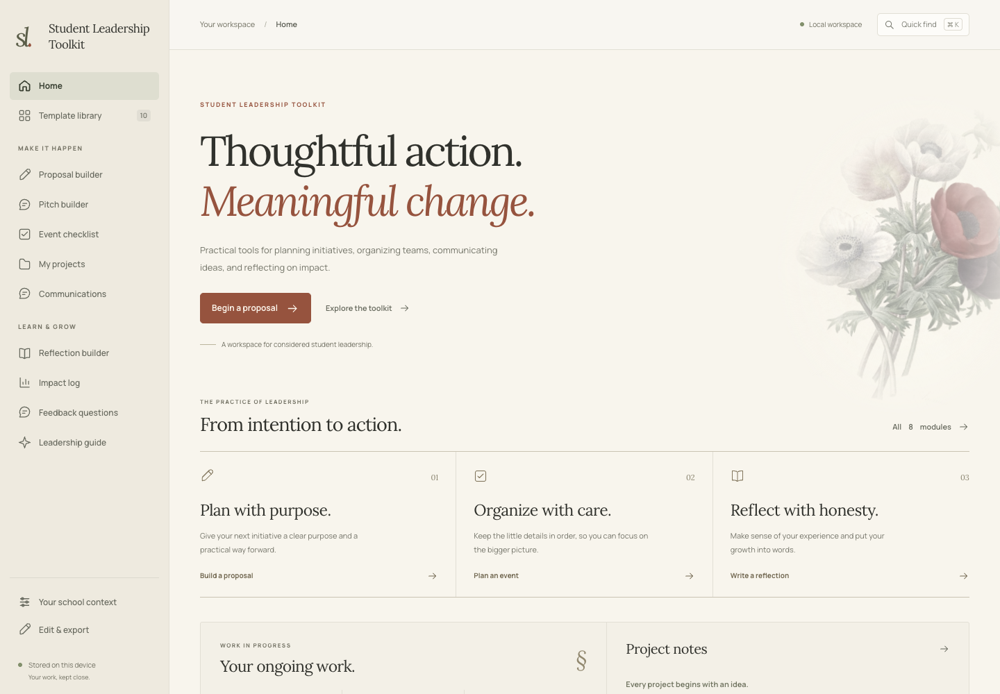
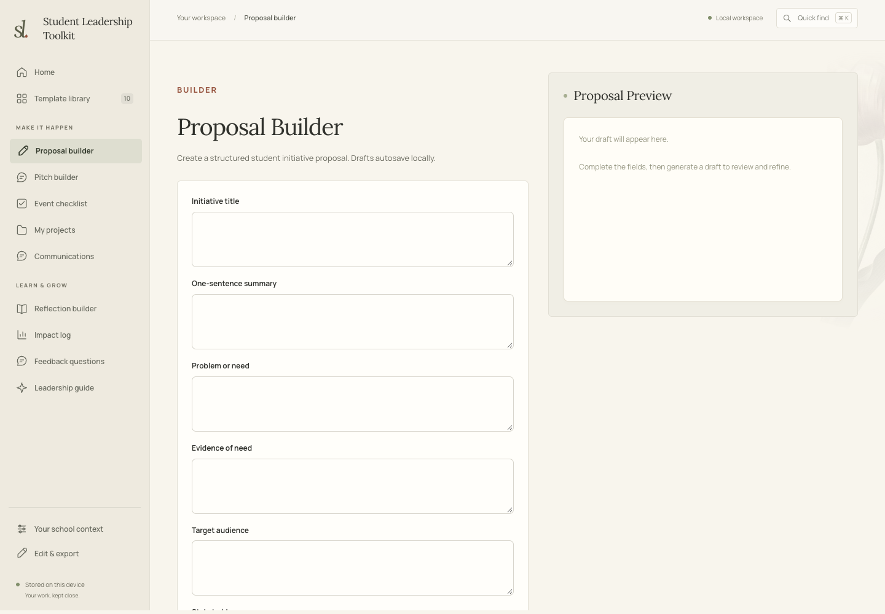
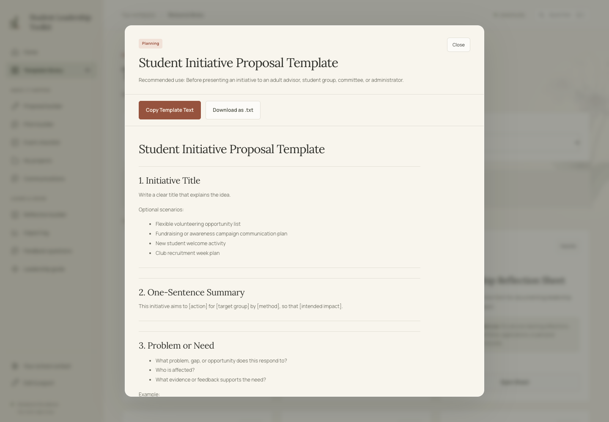
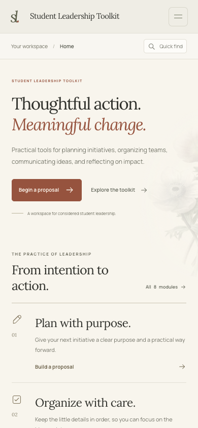

# Student Leadership Toolkit

A browser-based workspace for turning student initiatives into practical plans, coordinating activities, and recording what was learned. Built for student councils, clubs, service teams, peer mentors, and other school communities.

[Open the toolkit](https://academixottawa.github.io/student-leadership-toolkit/) · [View the repository](https://github.com/AcademixOttawa/student-leadership-toolkit)



## A focused workspace

The toolkit has **16 views**, with a persistent sidebar on desktop and a collapsible menu on mobile. Each tool has its own section URL, so direct links and browser Back and Forward navigation work. Home brings together actual saved project counts, draft counts, checklist progress, upcoming projects, and featured resources.

| Area | Views | What you can do |
| --- | --- | --- |
| Start | Home | Review ongoing work, resume a draft, or open a resource. |
| Plan and communicate | Proposal builder, Pitch builder, Communications | Draft a structured proposal, a 15/30/60-second pitch, or an announcement, email, briefing, caption, or poster message. |
| Organize | Event checklist, My projects | Track preparation tasks, deadlines, project statuses, goals, and next actions. |
| Reflect and document | Reflection builder, Impact log | Write short or detailed reflections and record quantitative evidence, qualitative observations, and feedback. |
| Find resources | Template library, Feedback questions, Case studies | Search, filter, favorite, copy, and download templates; explore questions and examples. |
| Learn the approach | Overview, Leadership framework, Toolkit modules, Action pathway | Explore the toolkit's purpose, planning framework, available tools, and suggested sequence of action. |
| Adapt | Your school context | Customize terminology for your school, team, adult support, and intended output. |

**Quick find:** press **⌘ K** on macOS or **Ctrl K** on Windows/Linux to search tools and resources. Use **↑ / ↓** to explore results, **Enter** to open one, and **Escape** to close search. The search button offers the same functionality without a keyboard shortcut.

## Visual design and interaction

- **Lora** serif headings and **Manrope** interface text are served from local font files.
- Warm paper colors, fine rules, and generous spacing support an editorial, academic visual style.
- Sixteen distinct historical botanical specimens sit directly in the page margins. The reflection view uses a *Rosa centifolia* plate.
- Slow botanical movement, subtle pointer response on the home view, and page transitions add motion. The system's **reduced-motion** preference disables these effects.
- Labeled controls, visible keyboard focus, modal focus handling, and responsive layouts support keyboard and mobile use. Print styles prioritize generated text.

### Tools in use

| Proposal builder | Resource modal |
| --- | --- |
|  |  |

<details>
<summary>View the mobile workspace</summary>



</details>

## Run locally

The site uses plain HTML, CSS, and JavaScript. There is **no build step, package installation, or external runtime service**. Fonts and artwork are included in the repository.

From the project directory, start a static server:

```bash
python3 -m http.server 8000
```

Then open [http://localhost:8000](http://localhost:8000). Any static file server can be used instead. Opening `index.html` directly is also possible, but a local server provides a consistent browser origin for saved work.

```text
index.html                 Page structure, navigation, and tool panels
styles.css                 Typography, layouts, responsive styles, and motion
app.js                     Toolkit content, forms, generators, and persistence
workspace.js               Routing, home summaries, quick find, and interactions
assets/
  fonts/                   Self-hosted fonts and their license files
  botanicals/              Per-view artwork and provenance records
  botanical-plate.jpg      Home artwork
  screenshots/             Documentation screenshots
  ARTWORK.md               Artwork sources, credits, and rights information
```

## Save, back up, and customize

Work is saved in the browser's `localStorage`: drafts, projects, impact entries, favorites, recently opened resources, checklist progress, context settings, and editable toolkit content.

Storage belongs to the **same browser profile and origin**. The hosted site and a local server have separate workspaces; changing the hostname, protocol, or port also changes the origin. Clearing site data removes saved work. There is no account, shared database, or cloud synchronization.

Use **Edit & export → Export All Data as JSON** to keep a backup or move work between browsers and origins. Import that JSON in the destination workspace to restore it. A full-workspace import replaces the saved workspace, so export existing work first. Text downloads are available for templates and generated documents, with additional exports for projects and impact entries. If browser storage is unavailable, the interface reports that changes have not been saved.

**Edit & export** also lets you change site text and add, edit, or remove resources. School-specific language is configured in **Your school context**. Developers can edit the default framework, modules, resources, questions, examples, and action pathway in `defaultToolkitData` within `app.js`.

## How generated text works

The proposal, pitch, reflection, communication, and impact-summary features combine built-in templates with the information entered by the user. They do **not** call an external AI service or verify the submitted evidence. Review and adapt generated text before sharing it.

The current project has no connected backend, collaborative editing, or built-in PDF/DOCX export. Browser printing and plain-text downloads are available; JSON is the workspace backup format.

## Publishing

The project's GitHub Pages configuration uses the **`main` branch, `/` (repository root)**:

[https://academixottawa.github.io/student-leadership-toolkit/](https://academixottawa.github.io/student-leadership-toolkit/)

HTML, CSS, scripts, fonts, and artwork use relative paths so the site works under `/student-leadership-toolkit/`. Publish the site files and their referenced assets together. After pushing a change, check the GitHub Pages deployment result and the hosted site before treating that version as live.

The same files can be served by other static hosts without a build process.

## Artwork and font licenses

Historical botanical artwork sources, individual page assignments, credits, rights statements, and source links are documented in [assets/ARTWORK.md](assets/ARTWORK.md). File checksums and download variants are recorded in [provenance-a.json](assets/botanicals/provenance-a.json) and [provenance-b.json](assets/botanicals/provenance-b.json). CSS applies masking, color treatment, and motion to the displayed images; the local source scans remain intact.

The bundled fonts include their SIL Open Font License files: [Lora](assets/fonts/lora-OFL.txt) and [Manrope](assets/fonts/manrope-OFL.txt).
